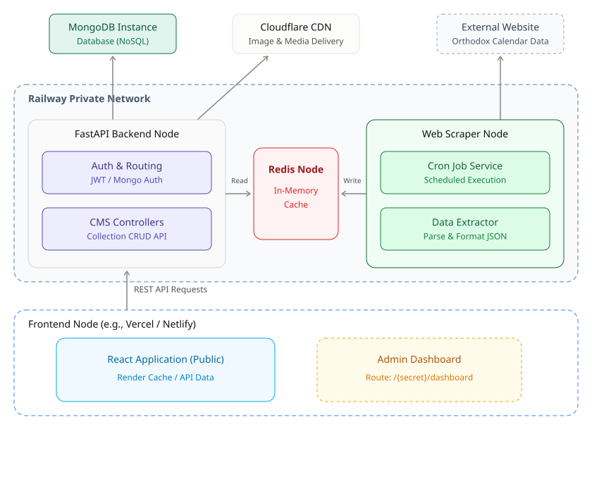

# Biserica „Sf. M. Mc. Gheorghe” — Parohia Sântana I

Presentation website and lightweight CMS for the Romanian Orthodox parish
Sântana I (Arad), live at **[parohia-santana-1.ro](https://parohia-santana-1.ro)**.
A public one-page site is rendered by a React app; the admin edits its
content from a hidden dashboard; a monthly scraper keeps the Orthodox
feast calendar in the events section up to date.

## Architecture

The system is deliberately **decoupled**: three independently deployable
components (frontend, backend, scraper) that never import each other and only
meet through the datastores and a REST API.



### Frontend Node

`frontend/` — Vite · React 19 · Tailwind CSS v4 · React Router.

- **React Application (public)** — a single scrolling page (hero, "next
  service" strip, about, weekly schedule, announcements & events, clergy,
  photo gallery, contact). It renders instantly from built-in default content
  in `src/data/site.js`, then hydrates each section with live API data.
- **Admin Dashboard** — `/login` and `/admin/dashboard` (guarded by
  `ProtectedRoute`), with one editor per section, a small rich-text editor,
  and drag-to-reorder gallery management with direct image upload. Both
  routes are served with `X-Robots-Tag: noindex, nofollow`.
- All API calls go through `src/lib/api.js` with `credentials: "include"`,
  so the httpOnly auth cookie travels with every request.

### Railway Private Network

#### FastAPI Backend Node

`backend/` — FastAPI · Uvicorn · PyMongo (async) · redis-py · slowapi ·
aioboto3 · uv. Layered **route → controller → service → db**.

- **Auth & Routing** — cookie-based JWT auth: `POST /auth/login` checks the
  bcrypt-hashed credentials in the `admin_accounts` collection and sets a
  7-day httpOnly cookie (`sb_admin_token`); `get_current_admin` guards every
  admin route; `GET /auth/me` / `POST /auth/logout` complete the flow. Auth
  endpoints are rate limited (5/hour per IP).
- **CMS Controllers** — one public `GET` and one admin-only `POST` per
  content section (`about`, `schedule`, `clergy`, `events`, `gallery`),
  validated by Pydantic schemas and sanitized with `nh3`. Gallery images are
  streamed to Cloudflare R2 under UUID names (JPEG/PNG/WebP, 10 MB cap).
  Reads are limited to 30/minute, writes to 10/hour per IP, with counters in
  Redis so limits survive restarts.
- `GET /health` pings MongoDB and Redis and returns `503` if either is down.

#### Redis Node

Decoupled in-memory cache shared by the backend and the scraper — one JSON
key per section (`content:<section>`, no TTL). Public reads are served from
Redis first; on a miss the backend falls back to MongoDB and repopulates the
key. Every save (admin panel or scraper) overwrites MongoDB and Redis
together, so the two stores stay in lockstep.

#### Web Scraper Node

`scraper/` — requests · BeautifulSoup · lxml · pymongo · redis.

- **Cron Job Service** — `scrape_calendar.py` is a one-shot script; the
  deployment platform schedules it.
- **Data Extractor** — pulls the Orthodox calendar for the current and next
  year, keeps only feast days, merges them with existing events (manual
  entries from the admin panel are untouched, old `source: "calendar"`
  entries are replaced, past feasts are dropped) and publishes the result to
  Redis and MongoDB in sync. If the page structure changes and extraction
  falls below a sanity threshold, it writes **nothing** and exits non-zero —
  stale data beats missing data.

### External services

- **MongoDB instance** — primary NoSQL datastore (a Railway database
  service): `site_content` (one document per section), `photo_gallery`
  (image references), `admin_accounts` (bcrypt hashes).
- **Cloudflare R2 + CDN** — object storage for gallery image bytes, served
  to visitors from the bucket's public URL.
- **noutati-ortodoxe.ro** — the external Orthodox calendar website the
  scraper reads once a year.

## Data flow

- **Public read** — `GET /content/<section>` → Redis; on a cache miss →
  MongoDB → repopulate Redis.
- **Admin write** — `POST /content/<section>` (auth cookie required) →
  MongoDB and Redis overwritten together.
- **Gallery upload** — image bytes → R2, reference document → MongoDB,
  `content:gallery` mirror → Redis.
- **Calendar refresh** — external website → parse & merge → MongoDB + Redis.

## Repository layout

```
frontend/          React SPA — public site + admin dashboard
backend/           FastAPI CMS API
scraper/           one-shot Orthodox-calendar scraper
architecture.svg   the diagram above
```

## Running locally

Prerequisites: Python 3.12+ with [uv](https://docs.astral.sh/uv/), Node 20+,
and reachable MongoDB and Redis instances.

**Backend** (http://localhost:8000, docs at `/docs`):

```bash
cd backend
cp .env.example .env   # set MONGO_URL, REDIS_URL, JWT_SECRET
uv sync
uv run python -m scripts.create_admin --username admin --password 'your-password'
uv run uvicorn app.main:app --reload
```

**Frontend** (http://localhost:5173, pointed at the local backend by
`.env.development`):

```bash
cd frontend
npm install
npm run dev
```

**Scraper** (one-shot run):

```bash
cd scraper
uv sync
uv run python scrape_calendar.py   # needs MONGO_URL + REDIS_URL in scraper/.env
```

## Deployment

Everything is hosted on **Railway** — frontend, backend, scraper, and both
databases run as services in a single project and talk to each other over the
private network:

- **Frontend** — built and served by `frontend/Dockerfile`: Vite build →
  nginx (`nginx.conf`, port 3000) with the SPA fallback, immutable caching
  for hashed assets, and `noindex` headers on `/login` and `/admin/*`.
  (A `vercel.json` with equivalent rewrites/headers is kept in the repo as
  an optional Vercel deployment path.)
- **Backend** — multi-stage `backend/Dockerfile` (uv build, non-root
  runtime, Uvicorn on 8000 with `--proxy-headers`). CORS allows the
  production domains and `localhost:5173`, with credentials.
- **Scraper** — `scraper/Dockerfile`, run as a Railway cron job (monthly).
- **MongoDB & Redis** — Railway database services; their connection URLs are
  injected into the backend and scraper through environment variables (see
  `backend/.env.example` and the scraper README).

The only piece outside Railway is **Cloudflare R2**, which stores and serves
the gallery images.
